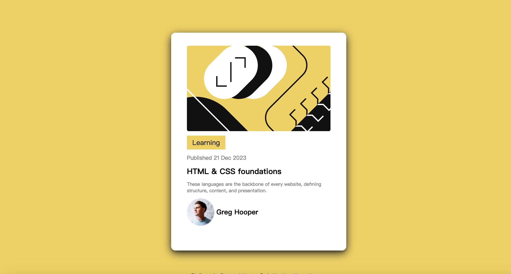

## Table of contents

- [Overview](#overview)
  - [The challenge](#the-challenge)
  - [Screenshot](#screenshot)
  - [Links](#links)
- [My process](#my-process)
  - [Built with](#built-with)
  - [What I learned](#what-i-learned)
  - [Continued development](#continued-development)
  - [Useful resources](#useful-resources)
- [Author](#author)
- [Acknowledgments](#acknowledgments)

## Overview

### The challenge

create box shadow

### Screenshot

### Links

- Solution URL: (https://github.com/Codingtry123/Blog-preview-card)
- Live Site URL: (https://blog-preview-card-exw.pages.dev)

## My process

### Built with

- Semantic HTML5 markup
- CSS custom properties
- Flexbox
- Mobile-first workflow

**Note: These are just examples. Delete this note and replace the list above with your own choices**

### What I learned

how to make website more responsive using media query 

the difference between the  impact of padding, margin on block element and the  impact of padding, margin on inline element 

### Continued development

learn impact of margin, padding border on the positon of block element and inline element

### Useful resources

https://www.w3schools.com/css/css_rwd_mediaqueries.asp

## Author

- Frontend Mentor - 
https://www.frontendmentor.io/profile/Codingtry123

